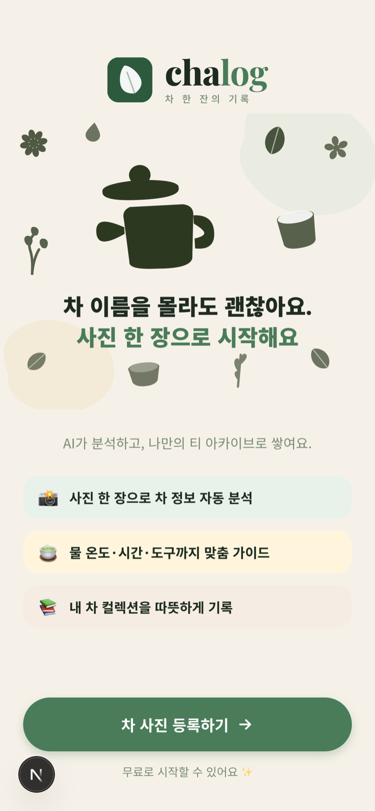
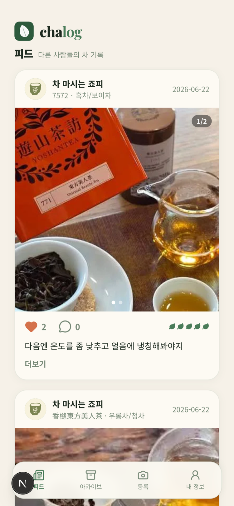
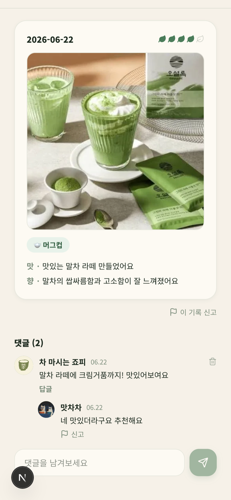
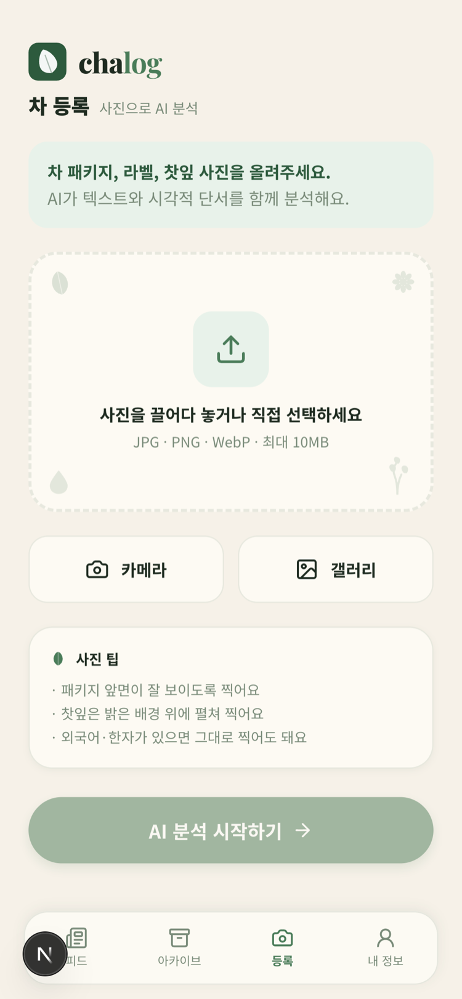
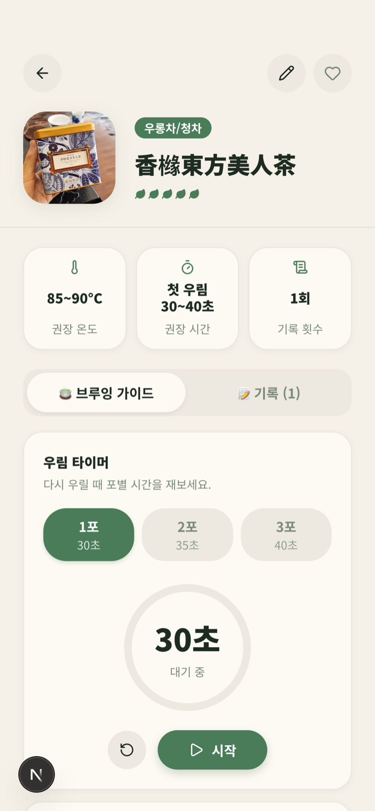
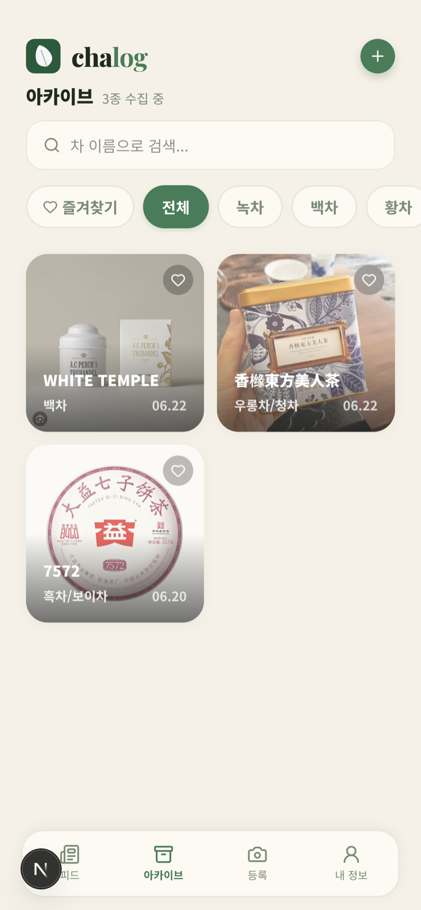
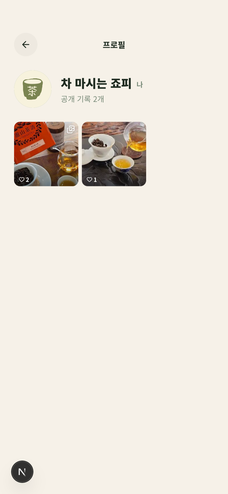

# chalog 🍵

> 차 사진 한 장으로 시작하는 AI 티 가이드 & 차 기록 커뮤니티

차 패키지·라벨·찻잎 사진을 올리면 AI가 차 정보를 분석하고, 그 차에 맞는 **우리는 가이드**를 생성해
**내 차 아카이브**에 저장합니다. 마실 때마다 시음 기록을 쌓고, 원하는 기록은 **피드에 공개**해
다른 사람들과 좋아요·댓글로 나눌 수 있어요.

차 이름을 정확히 맞히는 앱이 아니라, _"오늘 이 차를 어떻게 우려 마실지"_ 빠르게 알려주는 데 집중합니다.

<p align="center">
  
  
  
</p>

## ✨ 주요 기능

### AI 차 등록 & 브루잉 가이드
- 차 패키지·찻잎 **사진을 올리면 OpenAI Vision이 차 정보를 분석** (이름·종류·산지·연도 등)
- 부족한 정보는 사용자가 보정 → 그 차에 맞는 **물 온도·차 양·우림 시간·도구·헹굼** 가이드 생성
- **포별 우림 타이머**(1·2·3포) 내장 — 채워지는 링으로 시간 안내, 언제든 다시 사용

### 내 티 아카이브
- 등록한 차를 카드 그리드로 보관, 즐겨찾기·카테고리·검색
- 차마다 **시음 기록**(사진 여러 장·맛/향·우림 조건·평점·노트)을 쌓아 나만의 레시피로

### 커뮤니티 (인스타그램형 피드)
- 시음 기록을 **기록 단위로 공개/비공개** 설정 (비로그인도 피드 열람 가능)
- **사진 중심 피드** — 캐러셀, 노트 캡션 + 더보기, 좋아요 / 댓글 / **대댓글**
- **작성자 프로필**(`/u/[id]`) — 공개 기록 그리드
- 부적절한 기록·댓글 **신고**

### 계정
- 이메일 / **Google 로그인**, 닉네임·**프로필 사진** 설정, 비밀번호 변경/재설정
- 회원 탈퇴 시 저장 데이터·이미지 전체 삭제, 이용약관·개인정보처리방침

## 📸 화면

| 차 등록 (AI) | 브루잉 가이드 · 타이머 | 아카이브 | 작성자 프로필 |
|---|---|---|---|
|  |  |  |  |

## 🛠 기술 스택

| 레이어 | 사용 |
|--------|------|
| 프레임워크 | Next.js 16 (App Router) · React 19 · TypeScript · Turbopack |
| 백엔드 | Next.js Route Handlers (`/api/*`) · Server Actions |
| DB / 인증 / 스토리지 | Supabase (Postgres + RLS · Auth · Storage) |
| AI | OpenAI (Vision 차 분석 · 가이드 생성) |
| 데이터 페칭 | TanStack Query (낙관적 업데이트) |
| 상태 / 폼 | Zustand (등록 플로우) · React Hook Form + Zod |
| 스타일 | Tailwind CSS v4 · lucide-react |
| 배포 | Vercel |

### 아키텍처 메모
- **RLS 우선** — 모든 테이블에 Row Level Security. 본인 데이터 + 공개 콘텐츠 정책을 OR로 구성
- **공개 읽기는 서버 조합** — 비공개 `tea-images` 버킷의 타인 이미지는 service-role 관리자 클라이언트로 서명해 공개 API(`/api/feed`, `/api/p`, `/api/u`)에서만 제공
- **프로필 사진은 공개 `avatars` 버킷** — 서명 없이 직접 표시
- **카운터 트리거** — 좋아요/댓글 수는 `SECURITY DEFINER` 트리거로 집계
- **공개 단위 = 시음 기록(tea_log)** — 좋아요·댓글·대댓글·신고 모두 기록 단위

## 🚀 로컬 실행

```bash
npm install
cp .env.local.example .env.local   # Supabase / OpenAI 값 채우기
npm run dev                          # http://localhost:3000
```

### 환경변수
`NEXT_PUBLIC_SUPABASE_URL`, `NEXT_PUBLIC_SUPABASE_ANON_KEY`, `SUPABASE_SERVICE_ROLE_KEY`, `OPENAI_API_KEY` 등.
`.env.local.example` 참고. (`.env.local`은 커밋 금지)

### DB 마이그레이션
Supabase SQL Editor에서 `supabase/migrations/`의 파일을 **순서대로** 실행합니다.

| 파일 | 내용 |
|------|------|
| `0001_init.sql` | 기본 테이블 · RLS · Storage 버킷(`tea-images`) |
| `0003_log_social.sql` | 기록 단위 공개 · 좋아요 · 댓글 (0002 대체) |
| `0004_log_photos.sql` | 시음 기록 다중 사진 |
| `0005_avatars.sql` | 프로필 사진 + 공개 `avatars` 버킷 |
| `0006_replies_reports.sql` | 대댓글 + 신고 |

> `0002_community.sql`은 차 단위 커뮤니티 초기 버전으로, `0003`에서 기록 단위로 대체됩니다.
> 새로 세팅할 땐 0001 → 0003 → 0004 → 0005 → 0006 순서로 실행하세요.

## 🗺 화면 흐름

```
랜딩 → 로그인 → 등록(사진) → AI 분석 → 결과 → 정보 보정 → 브루잉 가이드 → 아카이브 → 차 상세 → 기록 추가
                                                                         피드 → 공개 기록 상세 → 작성자 프로필
```

로그인 상태에서는 루트(`/`)가 **피드**로 연결됩니다.

## 📂 프로젝트 구조

```
src/
├─ app/                 라우트 + Route Handlers + Server Actions
│  ├─ feed · p · u      커뮤니티 (피드 · 공개 기록 · 작성자 프로필)
│  ├─ archive · tea     아카이브 · 차 상세 / 기록
│  ├─ upload · analyze · result · correction · guide   AI 등록 플로우
│  └─ my · login · terms · privacy
├─ components/          UI 컴포넌트 (Avatar · PhotoCarousel · BrewTimer · 레이아웃 등)
├─ lib/
│  ├─ supabase/         client / server / admin(service-role)
│  ├─ openai/           OpenAI 클라이언트
│  ├─ schemas/          Zod 데이터 계약
│  └─ types/            DB 타입
└─ store/               Zustand (등록 플로우)
supabase/migrations/    DB 스키마
docs/screenshots/       README 스크린샷
```

---

개인 사이드 프로젝트입니다. 운영자 주소희 · jyophie@gmail.com
